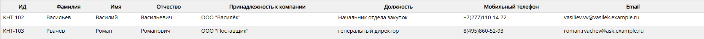

# Как изменить информацию о Контакте

Перейдите на страницу "Контакт", для этого в левой части экрана укажите мышью на значок    и выберите    в Главном меню приложения.

Наведите курсор на контакт в списке (выбранная строка подсвечивается) и нажмите правую кнопку мыши. На экране отобразится страница с информацией о контакте.  
 

Внесите необходимые изменения, нажмите кнопку "Сохранить данные" на панели инструментов. 
 

