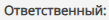
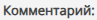

# Как внести новый Контакт

Перейдите на страницу "Контакт", для этого в левой части экрана укажите мышью на значок    и выберите    в Главном меню приложения.

---

Нажмите кнопку "Создать контакт" на панели инструментов. 
 

---

В любой момент нажмите кнопку "Сохранить данные" на панели инструментов чтобы сохранить сделанные изменения. 
 

<table style="border:none;">
<tr>
    <td style="vertical-align: middle;">
    
    </td>
    <td style="vertical-align: middle;">
    
Введите фамилию контактного лица

    </td>
</tr>
<tr>
    <td style="vertical-align: middle;">
    
    </td>
    <td style="vertical-align: middle;">
    
Введите имя контактного лица

    </td>
</tr>
<tr>
    <td style="vertical-align: middle;">
    
    </td>
    <td style="vertical-align: middle;">
    
Введите отчество контактного лица

    </td>
</tr>
<tr>
    <td style="vertical-align: middle;">
    </td>
    <td style="vertical-align: middle;">
    
Выберите компанию, сотрудником которой является данное контактное лицо.  
    По умолчанию, компания не определена и помечена как "отсутствует".  
    Если информация о компании отсутствует в CRM перейдите на страницу "Компании" и создайте новую запись.

    </td>
</tr>
<tr>
    <td style="vertical-align: middle;">
    
    </td>
    <td style="vertical-align: middle;">
    
Укажите должность сотрудника в свободной форме

    </td>
</tr>

<tr>
    <td style="vertical-align: middle;">
    
    </td>
    <td style="vertical-align: middle;">
    
Введите номер основного телефона по месту работы

    </td>
</tr>

<tr>
    <td style="vertical-align: middle;">
    
    </td>
    <td style="vertical-align: middle;">
    
Введите номер мобильного телефона

    </td>
</tr>

<tr>
    <td style="vertical-align: middle;">
    
    </td>
    <td style="vertical-align: middle;">
    
Укажите адрес электронной почты сотрудника.'.
    Не указывайте общие электронные адреса организации, эту информации лучше разместить в разделе "Компании"

    </td>
</tr>

<tr>
    <td style="vertical-align: middle;">
    </td>
    <td style="vertical-align: middle;">
    
Выберите сотрудника Вашей организации, ответственного за взаимодействие с данной организацией.  
        По умолчанию, указывается ФИО сотрудника, который заполняет форму Контакта.  
        Список сотрудников Вашей организации формируется на этапе конфигурации CRM. Для внесения изменения в список обратитесь к Вашему руководителю и администратору CRM.

        </td>
</tr>

<tr>
    <td style="vertical-align: middle;">
    </td>
    <td style="vertical-align: middle;">
    
Введите дополнительную информацию о контактном лице в свободной форме
</td>
</tr>

</table>
