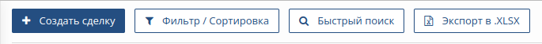

# Как завести новое обращение (сделку)
    - с использованием уже имеющихся в системе данных; 
	- с добавлением новых данных;

1. При создании Cделки потребуется указать заказчика, а так же, возможно, партнера и дистрибьютора. Если информация об организации отсутствует в CRM перейдите на страницу {: style="height:20px;width=200px"} и создайте новую запись, затем вернитесь на страницу cделки.
 
2. Перейдите на страницу "Сделки", для этого в левой части экрана укажите мышью на значок  {: style="height:20px;width=20px"}  и выберите  {: style="height:20px;width=200px"}  в Главном меню приложения.
   
3. Нажмите кнопку "Создать сделку" на панели инструментов. {: style="height:50px;width=200px"}  

4. В поле "Название сделки" введите название, которое будет использовано для отображения Сделки во всех отчетах. 
> Рекомендация!
>Использование уникального текста ускорит поиск конкретной сделки в большом списке.
>Использование устоявшихся терминов, названия товара, количества и т.п. информации, позволит быстро "ухватить" суть сделки.

5. В поле "Плановая дата оплаты" выберите дату оплаты с помощью календаря. По умолчанию, календарь подсвечивает текущую дату.
   
6. В поле "Дата закрытия" выберите дату закрытия сделки по факту окончательного расчета (оплаты), с помощью календаря. По умолчанию, календарь подсвечивает текущую дату.

7. В поле "Стадия сделки" выберите текущую стадию сделки из выпадающего списка. 

    По умолчанию, стадия сделки не задана и помечена как "отсутствует". 
    
    Список стадий сделки формируется на этапе конфигурации CRM на основании бизнес-процессов, принятых в Вашей организации. Для внесения изменения в список обратитесь к Вашему руководителю и администратору CRM.

8. В поле "Вероятность" выберите вероятность успешного завершения сделки. 
   
    По умолчанию, вероятность сделки не задана и помечена как "отсутствует". 
   
    Список значений для данного поля формируется на этапе конфигурации CRM на основании бизнес-процессов, принятых в Вашей организации. Для внесения изменения в список обратитесь к Вашему руководителю и администратору CRM.

9.  В поле "Ответственный" выберите сотрудника Вашей организации, ответственного за проведение данной сделки, либо всех сделок с этим Заказчиком или Партнером. 
    
    По умолчанию, указывается ФИО сотрудника, который заполняет форму Сделки. 
    
    Список сотрудников организации формируется на этапе конфигурации CRM. Для внесения изменения в список обратитесь к Вашему руководителю и администратору CRM.

10. В поле "Компания покупатель (дистрибьютор)" выберите дистрибьютора для данной Сделки. 
    
    Список дистрибьюторов в CRM формируется сотрудниками на основании имеющейся информации о ключевых игроках рынка.

    Если информация о дистрибьюторе отсутствует в CRM перейдите на страницу {: style="height:20px;width=200px"} и создайте новую запись, затем вернитесь на страницу cделки.

11. В поле "Компания покупатель (партнер)" выберите партнера для данной Сделки. 
    
    Список партнеров в CRM формируется сотрудниками на основании имеющейся информации о ключевых игроках рынка.

    Если информация о партнере отсутствует в CRM перейдите на страницу {: style="height:20px;width=200px"} и создайте новую запись, затем вернитесь на страницу cделки.

12. В поле "Компания покупатель (заказчик)" выберите заказчика для данной Сделки. 
    
    Список заказчиков в CRM формируется сотрудниками на основании имеющейся информации о ключевых игроках рынка.

    Если информация о заказчике отсутствует в CRM перейдите на страницу {: style="height:20px;width=200px"} и создайте новую запись, затем вернитесь на страницу cделки.