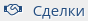
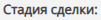

# Как завести новое обращение (сделку)

Перейдите на страницу "Сделки", для этого в левой части экрана укажите мышью на значок  и выберите    в Главном меню приложения.

Нажмите кнопку "Создать сделку" на панели инструментов
 

При создании Cделки потребуется указать заказчика, партнера или дистрибьютора. Если информация об организации отсутствует в CRM перейдите на страницу   и создайте новую запись, затем вернитесь на страницу cделки.

В любой момент нажмите кнопку "Сохранить данные" на панели инструментов чтобы сохранить сделанные изменения. 
 

 
<b>Поля сделки</b>

<table style="table-layout:fixed;width: 100%;border: none;">
    <colgroup>
        <col style="width: 20%;">
        <col style="width: 80%;">
    </colgroup>
<tr>
    <td style="vertical-align: middle;">
    
    </td>
    <td style="vertical-align: middle;">
    
Введите название, которое будет использовано для отображения Сделки во всех отчетах

    
Использование уникального текста ускорит поиск конкретной сделки в большом списке.
    Использование устоявшихся терминов, названия товара, количества и т.п. информации, позволит быстро "ухватить" суть сделки.

    </td>
</tr>

<tr>
    <td style="vertical-align: middle;">
    
    </td>
    <td style="vertical-align: middle;">
    
Выберите дату оплаты с помощью календаря. 
     По умолчанию, календарь подсвечивает текущую дату.

    </td>
</tr>

<tr>
    <td style="vertical-align: middle;">
    
    </td>
    <td style="vertical-align: middle;">
    
Выберите дату закрытия сделки по факту окончательного расчета (оплаты) с помощью календаря.
     По умолчанию, календарь подсвечивает текущую дату.

    </td>
</tr>

<tr>
    <td style="vertical-align: middle;">
    
    </td>
    <td style="vertical-align: middle;">
    
Выберите текущую стадию сделки из списка. 
     По умолчанию, стадия сделки не задана и помечена как "отсутствует".
 
    
Список стадий сделки формируется на этапе конфигурации CRM на основании бизнес-процессов, принятых в Вашей организации. Для внесения изменения в список обратитесь к Вашему руководителю и администратору CRM.

    </td>
</tr>

<tr>
    <td style="vertical-align: middle;">
    
    </td>
    <td style="vertical-align: middle;">
    
Выберите вероятность успешного завершения сделки из списка. 
     По умолчанию, вероятность сделки не задана и помечена как "отсутствует".

    
Список значений для данного поля формируется на этапе конфигурации CRM на основании бизнес-процессов, принятых в Вашей организации. Для внесения изменения в список обратитесь к Вашему руководителю и администратору CRM.

    </td>
</tr>

<tr>
    <td style="vertical-align: middle;">
    
    </td>
    <td style="vertical-align: middle;">
    
Выберите сотрудника Вашей организации, ответственного за проведение данной сделки, либо всех сделок с этим Заказчиком или Партнером. 
     По умолчанию, указывается ФИО сотрудника, который заполняет форму Сделки.

    
Список сотрудников Вашей организации формируется на этапе конфигурации CRM. Для внесения изменения в список обратитесь к Вашему руководителю и администратору CRM.

    </td>
</tr>

<tr>
    <td style="vertical-align: middle;">
    
    </td>
    <td style="vertical-align: middle;">
    
Выберите дистрибьютора для данной Сделки из списка компаний.

    
Список дистрибьюторов в CRM формируется сотрудниками на основании имеющейся информации о ключевых игроках рынка. Если информация о дистрибьюторе отсутствует в CRM перейдите на страницу  и создайте новую запись, затем вернитесь на страницу cделки.

    </td>
</tr>

<tr>
    <td style="vertical-align: middle;">
    
    </td>
    <td style="vertical-align: middle;">
    
Выберите партнера для данной Сделки из списка компаний.
 
    
Список партнеров в CRM формируется сотрудниками на основании имеющейся информации о ключевых игроках рынка. Если информация о партнере отсутствует в CRM перейдите на страницу  и создайте новую запись, затем вернитесь на страницу cделки.

    </td>
</tr>

<tr>
    <td style="vertical-align: middle;">
    
    </td>
    <td style="vertical-align: middle;">
    
Выберите заказчика для данной Сделки из списка компаний
 
    
Список заказчиков в CRM формируется сотрудниками на основании имеющейся информации о ключевых игроках рынка. Если информация о заказчике отсутствует в CRM перейдите на страницу 
    
     и создайте новую запись, затем вернитесь на страницу cделки.

    </td>
</tr>

<tr>
    <td style="vertical-align: middle;">
    
    </td>
    <td style="vertical-align: middle;">
    
Введите условия доставки товара

    </td>
</tr>

<tr>
    <td style="vertical-align: middle;">
    
    </td>
    <td style="vertical-align: middle;">
    
Введите информацию о сделке, которая требует внимания или участия Вашего руководителя.
     При наличии информации в этом поле идентификатор сделки (СДЛ) в списке сделок подсвечивается красным цветом.

    </td>
</tr>

<tr>
    <td style="vertical-align: middle;">
    
    </td>
    <td style="vertical-align: middle;">
    
Укажите ссылку на файл в облачном хранилище

    </td>
</tr>

</table>
  