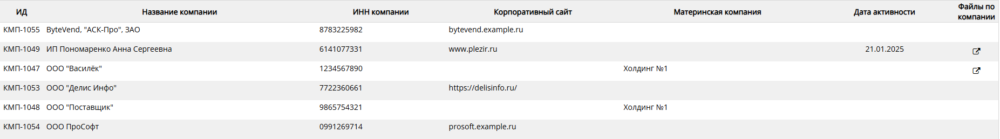

# Как изменить информацию Компанию

Перейдите на страницу "Компании", для этого в левой части экрана укажите мышью на значок    и выберите    в Главном меню приложения.

Наведите курсор на название компании в списке (выбранная строка подсвечивается) и нажмите правую кнопку мыши. На экране отобразится страница с информацией о компании.  
 

Внесите необходимые изменения, нажмите кнопку "Сохранить данные" на панели инструментов. 
 

