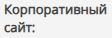
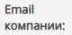
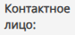
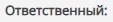
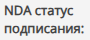
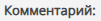

#  Как добавить новую Компанию

Перейдите на страницу "Компании", для этого в левой части экрана укажите мышью на значок    и выберите    в Главном меню приложения.

---

Нажмите кнопку "Создать компанию" на панели инструментов. 
 

---

В любой момент нажмите кнопку "Сохранить данные" на панели инструментов чтобы сохранить сделанные изменения. 
 

<table style="border: none;">
<tr>
    <td style="vertical-align: middle;">
    
    </td>
    <td style="vertical-align: middle;">
    
Введите название компании в свободной форме

    </td>
</tr>

<tr>
    <td style="vertical-align: middle;">
    
    </td>
    <td style="vertical-align: middle;">
    
Введите ИНН юридического лица

    </td>
</tr>

<tr>
    <td style="vertical-align: middle;">
    
    </td>
    <td style="vertical-align: middle;">
    
Введите тип организации, например, коммерческая, общественная, бюджетная, правительственная и т.п.

    </td>
</tr>

<tr>
    <td style="vertical-align: middle;">
    
    </td>
    <td style="vertical-align: middle;">
    
Укажите один или несколько телефонных номеров для связи

    </td>
</tr>

<tr>
    <td style="vertical-align: middle;">
    
    </td>
    <td style="vertical-align: middle;">
    
Укажите адрес сайта компании в Интернет

    </td>
</tr>

<tr>
    <td style="vertical-align: middle;">
    
    </td>
    <td style="vertical-align: middle;">
    

    Укажите один или несколько общих адресов электронной почты в компании.
    Не указывайте электронные адреса конкретных сотрудников, эту информации лучше разместить в разделе "Контакты"
    

    </td>
</tr>

<tr>
    <td style="vertical-align: middle;">
    </td>
    <td style="vertical-align: middle;">
    
Выберите из списка сотрудников ответственного за взаимодействие с Вашей организацией.
    Если информация о сотруднике отсутствует в CRM перейдите в раздел "Контакты" и создайте новую запись, затем вернитесь на страницу компании
    

    </td>
</tr>

<tr>
    <td style="vertical-align: middle;">
    </td>
    <td style="vertical-align: middle;">
    
Укажите ФИО сотрудника компании, который может выступить заместителем основного контактного лица

    </td>
</tr>
<tr>
    <td style="vertical-align: middle;">
    </td>
    <td style="vertical-align: middle;">
    
Выберите сотрудника Вашей организации, ответственного за взаимодействие с данной организацией.  
        По умолчанию, указывается ФИО сотрудника, который заполняет форму Компании.  
        Список сотрудников Вашей организации формируется на этапе конфигурации CRM. Для внесения изменения в список обратитесь к Вашему руководителю и администратору CRM.

        </td>
</tr>
<tr>
    <td style="vertical-align: middle;">
    </td>
    <td style="vertical-align: middle;">
    
В свободной форме укажите статус согласования/подписания Соглашения о неразглашении

    </td>
</tr>
<tr>
    <td style="vertical-align: middle;">
    </td>
    <td style="vertical-align: middle;">
    
Выберите организацию, которая является управляющей, по отношению к данной организации.  
    По умолчанию, материнская компания не определена и помечена как "отсутствует".  
    Список компаний в CRM формируется сотрудниками на основании имеющейся информации о ключевых игроках рынка.
    Если информация о материнской компании отсутствует в CRM перейдите на страницу "Компании" и создайте новую запись.

    </td>
</tr>
<tr>
    <td style="vertical-align: middle;">
    </td>
    <td style="vertical-align: middle;">
    
Введите дополнительную информацию о компании в свободной форме
</td>
</tr>
<tr>
    <td style="vertical-align: middle;">
    </td>
    <td style="vertical-align: middle;">
    
Укажите ссылку на файл в облачном хранилище
</td>
</tr>

</table>
