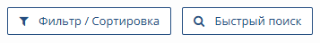

# Как изменить информацию в CRM

Для внесения изменений в информацию о Сделке, Компании или Контакте перейдите в соответствующий раздел в Главном меню приложения 

,
 
или

Наведите курсор на нужную запись в списке (выбранная строка подсвечивается) и нажмите правую кнопку мыши. На экране отобразится страница с детальной информацией. 
  
Для выбора записи по критерию воспользуйтесь функцией "Фильтр / Сортировка" или "Быстрый поиск" на панели инструментов.
 

Внесите необходимые изменения и нажмите кнопку "Сохранить данные" на панели инструментов. 
 

