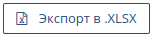

# Экспорт данных в табличный документ

Функция "Экспорт в XLSX" позволяет сделать выгрузку данных о Сделках и Компаниях в табличный документ с расширением XLSX.
Применение фильтра к списку сделок (компаний) ограничивает выгрузку только теми записями, которые соответствуют критериям отбора.

<ul>
<li>

Откройте раздел "Сделки" 

или "Компании"
 
;

</li>
<li>
Нажмите кнопку 
 
на панели инструментов;
</li>
<li>Система CRM сформирует табличный файл вида NAKAZ_ДАТА.xlsx, где ДАТА - дата и время создания файла и поместит файл на компьютер в каталог "Загрузки" (Downloads).
</li>
</ul>

 