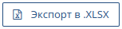

# Быстрый поиск

Поиск текстовой информации "Быстрый поиск" доступен в разделах Сделки, Компании, Контакты и Товары. Поисковый запрос возвращает записи для которых найдено полное или частичное совпадение значений полей с текстом в строке поиска.

<b style="font-size:120%">Поиск сделки</b>

В списке сделок нажмите кнопку
 на панели инструментов и введите текст для поиска, затем нажмите Enter.
 
 

Система произведет отбор записей по значениям полей <i>"Название сделки"</i> и <i>"Ответственный"</i>, сравнивания их с искомым текстом. 
 
 

Нажмите кнопку
 
на панели инструментов для выгрузки отчета в табличной форме по списку отобранных сделок.
 
Файл отчета размещается в папке Загрузки (Downloads).

Нажмите кнопку
 
для отмены поисковых ограничений и вывода полного списка сделок.

<b style="font-size:120%">Поиск компании</b>

В списке компаний нажмите кнопку 
,
введите текст для поиска и нажмите Enter.
Система произведет отбор записей по значению поля <i>"Название компании"</i>, сравнивания его с искомым текстом. 

Нажмите кнопку
 
на панели инструментов для выгрузки отчета в табличной форме по списку отобранных компаний. Файл отчета размещается в папке Загрузки (Downloads).

Нажмите кнопку
 
для отмены поисковых ограничений и вывода полного списка компаний.

<b style="font-size:120%">Поиск контакта</b>

В списке контактов нажмите кнопку 
, 
введите текст для поиска и нажмите Enter. 
Система произведет отбор записей по значениям полей <i>"Фамилия"</i>, <i>"Имя"</i>,  <i>"Отчество"</i>, <i>"Принадлежность к компании"</i>, <i>"Должность"</i>, <i>"Мобильный телефон"</i>, <i>"Email"</i>, сравнивания их с искомым текстом. 

Нажмите кнопку
 
для отмены поисковых ограничений и вывода полного списка контактов.

<b style="font-size:120%">Поиск товара</b>

В списке товаров нажмите кнопку 
, 
введите текст для поиска и нажмите Enter. Система произведет отбор записей по значению поля <i>"Название товара"</i>, сравнивания его с искомым текстом. 

Нажмите кнопку
 
для отмены поисковых ограничений и вывода полного списка товаров.

