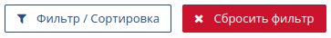
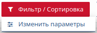
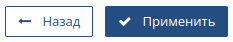
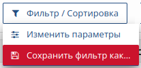
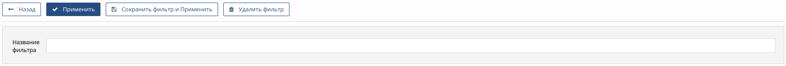
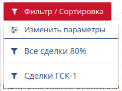
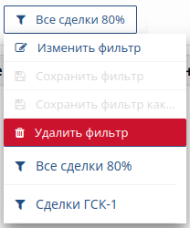

# Фильтр и сортировка

Функция фильтрации и сортировки позволяет создавать фиксированные шаблоны для представления списков Сделки и Компании. Шаблоны представления позволяют быстро переключаться между различными группами сделок, например:
<ul>
<li>все сделки в стадии закупки (80%);</li>
<li>все сделки больше 20 млн.;</li>
<li>сделки, записанные за определенным сотрудником (отбор по полю "Ответственный");</li>
<li>сделки, требующие внимания руководителя (отбор по полю "Нужна помощь") и т.д.</li>
</ul>

Чтобы вернуться <b>к полному списку</b> сделок нажмите кнопку "Сбросить фильтр" на панели инструментов
 

<pict>

<b style="font-size:120%">Создание фильтра</b>

<ul>
<li>

Откройте раздел "Сделки" 

или "Компании"
 
;

</li>
<li>

Наведите курсор мыши на кнопку "Фильтр/Сортировка", в выпадающем меню выберите пункт "Изменить параметры";
 

</li>
<li>Введите критерии отбора на форме "Фильтрация";</li>
<li>

Нажмите кнопку "Применить" на панели инструментов. 
 

Система возвращает Вас на страницу со списком Сделок (Компаний), при этом отображаются только те сделки (компании), которые соответствуют критериями отбора;

</li>
<li>

Сохраните этот шаблон, если Вы планируте часто работать с таким представлением списка. Для этого наведите курсор мыши на кнопку "Фильтр/Сортировка" и в выпадающем меню выберите пункт "Сохранить фильтр как...".
 

</li>
<li>

В поле "Название фильтра" введите название для Вашего шаблона в произвольной форме и нажмите кнопку "Сохранить фильтр и применить" на панели инструментов.
 

</li>
</ul>

Список доступных фильтров отображается при наведении курсора мыши на кнопку "Фильтр/Сортировка".
 

<b style="font-size:120%">Удаление фильтра</b>

Фильтр должен быть активирован перед тем, как станет возможным его удаление.

<ul>
<li>

Наведите курсор мыши на кнопку "Фильтр/Сортировка" на панели инструментов. В выпадающем меню выберите фильтр, который должен быть удален;

</li>
<li>

Выбранный фильтр будет применен к списку (активирован) и представление списка изменит вид;

</li>
<li>

Снова наведите курсор мыши на кнопку "Фильтр/Сортировка" и выберите пункт "Удалить фильтр" в выпадающем меню;
 

</li>
<li>Система CRM деактивирует и удалит фильтр, а представление списка вернется в состояние по умолчанию (полный список всех сделок/компаний).</li>
</ul>

